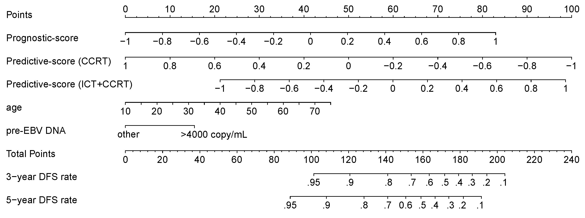
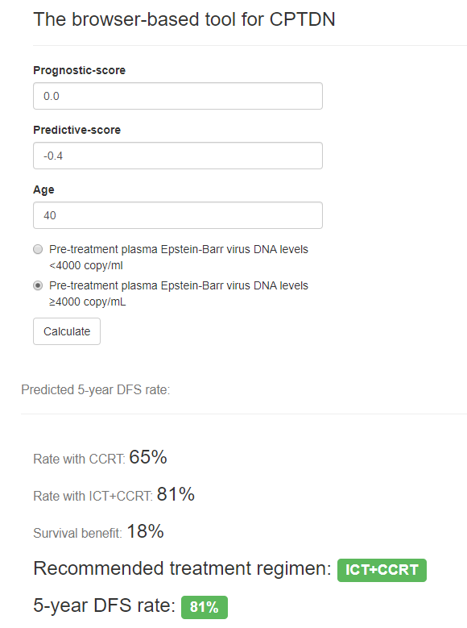

# A multi-task deep learning-based radiomic nomogram for prognosis and treatment decision in nasopharyngeal carcinoma patients with stage T3N1M0
Induction chemotherapy (ICT) plus concurrent chemoradiotherapy (CCRT) and CCRT alone were the optional treatment regimens in locoregionally advanced nasopharyngeal carcinoma (NPC) patients. However, previous prognostic models of NPC did not take the treatment factor into account, neglecting the fact that the heterogeneity of therapy could result in their poor performances in clinical practice. We aim to use multi-task deep-learning radiomics to develop simultaneously prognostic and predictive signatures from pretreatment magnetic resonance (MR) images of NPC patients, and to construct a combined prognosis and treatment decision nomogram (CPTDN) for recommending the optimal treatment regimen and predicting the prognosis of NPC. The manuscript of this study has been submitted to the *Annals of Oncology*, titled “A multi-task deep learning-based radiomic nomogram for prognosis and treatment decision in nasopharyngeal carcinoma patients with stage T3N1M0”.  
## CPTDN
  
A CPTDN was built for predicting simultaneously disease-free survival (DFS) and treatment response. The CPTDN could noninvasively recommend an optimal treatment regimen and predict patient prognosis. For example, consider a 40-year-old target patient with stage T3N1M0, a pre-EBV DNA of >4000 copy/mL, a Prognostic-score of 0.0, and a Predictive-score of -0.4; If the patient received ICT+CCRT, the patient’s total score would be 122 (21+15+41+45), for which the 5-year DFS rate is estimated at 81%. If the patient received CCRT, the patient’s score would be 147 (21+15+41+70), for which the 5-year DFS rate is estimated at 63%. The 5-year survival benefit of receiving ICT+CCRT vs. receiving CCRT is 18%, so the CPTDN would recommend ICT+CCRT and provide a 5-year DFS rate of 81%. CCRT, concurrent chemoradiotherapy; ICT, induction chemotherapy; DFS, disease-free survival; pre-EBV DNA, pre-treatment plasma Epstein-Barr virus DNA.  
## A web browser-based tool for CPTDN
In order to facilitate its validation and application, We have developed a user-friendly web browser-based tool for our CPTDN on an open-access website (http://www.radiomics.net.cn/CPTDN_tool). The screenshot of the operation interface is as follows:  
 
## Descriptions of code and data
### Data
matched_data_from_center1.csv: matched data from center 1 using nearest neighbor matching method  
matched_data_from_center2-4.csv: matched data from center 2-4 using nearest neighbor matching method  
T1_dlFeature.csv: deep radiomic features from T1-weighted MR sequence  
T2_dlFeature.csv: deep radiomic features from T2-weighted MR sequence  
T1C_dlFeature.csv: deep radiomic features from contrast enhanced T1-weighted MR sequence  
MR_RadSigs.csv: the proposed Prognostic-score and Predictive-score using a multi-task deep learning method
### Code
R/MatchPatient.R: obtain matched patients with similar baseline characteristics between treatment using nearest neighbor matching method  
R/DataAnalysisForProg_Pred.R: survival analysis code  
python/DeepFeatureExtraction.py: the feature extraction network  
python/RadiomicSignaturesBuilding.py: the signature building network  
